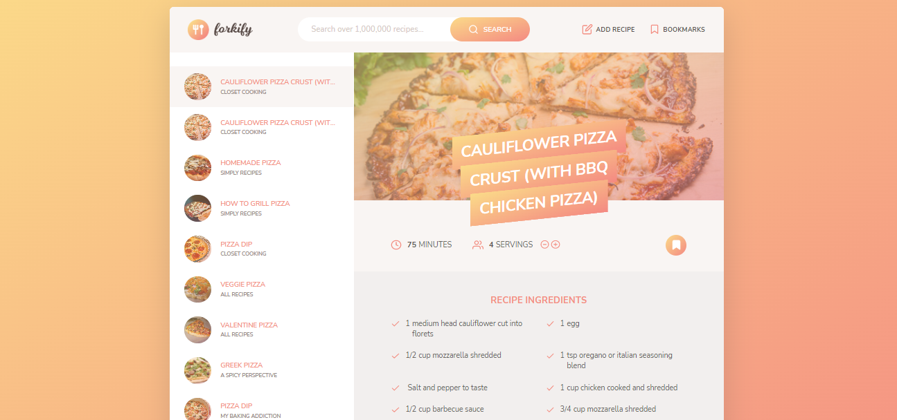

# Food Order App

A nice food order application where you can order food.

## Table of contents

- [Overview](#overview)
  - [The app](#the-app)
  - [Screenshot](#screenshot)
  - [Built with](#built-with)
  - [Used Features](#used-features)
- [Author](#author)

## Overview

### The app

Users should be able to:

- View the optimal layout depending on their device's screen size
- Initially, they can search for the food they want
- They can examine the detailed information of the food they want from the foods returned from the database.
- They can add the dishes to the bookmark list
- They can add food with the necessary information to the database

### Screenshot

### Built with

- React.JS
- CSS custom properties
- Redux 

### Used Features
- useState
- useEffect
- useSelector
- useDispatch
- configureStore
- createSlice
- REST API

## Author

- Website - [Damla Kara](https://www.linkedin.com/in/damla-kara-348081232/)